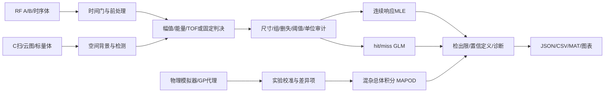

# 方法体系、数学说明与软件架构

## 1. 范围和术语

本报告基于用户提供的 MIL-HDBK-1823A（2009），重点研读 Appendix G 的 â–a、hit/miss、置信边界和噪声分析，并结合 Appendix E/I 的试验设计、群体差异和尺寸问题。检索日期为 2026-10-08；近五年按 2021-10 至 2026-10 的发表时段整理代表性原始研究。这里的“系统总结”是方法分类和可追溯算法清单，不能解释为已穷尽整个行业所有论文、商业系统或全部算法变体。

MAPOD 通常指 Model-Assisted Probability of Detection，利用物理仿真、实验校准和不确定性传播辅助估计 POD。删失是数据只知道落在某个范围；缺失是结果没有观测到。二者都能影响模型辅助 POD，但不是 MAPOD 的定义。SMAPOD 在不同资料中可能指仿真/统计模型辅助流程；检索未发现唯一的通用命名约定，本项目不把它当作一个已确定的独立标准算法。

POD(a)=P(判定检出 | 缺陷尺寸 a、指定检测流程和总体)。它不是缺陷尺寸的累计分布。a90 是拟合曲线达到 0.9 的尺寸；a90/95 表示所选择统计约定下的可靠检出尺寸。a90/95 不是“95% 的样品检测到 90% 缺陷”的直接样本比例。

## 2. 方法分类及算法索引

| 方法族 | 数据/模型 | 主要算法 | 本包状态 |
|---|---|---|---|
| 二项比例与固定尺寸资格点 | 独立检出/漏检计数 | Clopper–Pearson、单侧上下限；29/29 演示 | 双语言实现 |
| hit/miss GLM | Bernoulli 条件分布 | logit/probit/cloglog/loglog，MLE，Fisher 信息，LR、Wald | 双语言实现 |
| â–a 连续响应 | 正态变换响应，常方差线性模型 | 高斯 MLE、log/linear 变换、Delta 方法、阈值积分 | 双语言实现 |
| 删失响应 | 点值、左/右/区间边界 | 密度/CDF/生存函数/区间概率，混合似然，观测信息 | 双语言实现 |
| 响应缺失 | MAR 条件可忽略机制 | 显式排除并保留审计计数 | 双语言实现；MNAR 未实现 |
| 重复检测、操作者差异 | 组/试件/操作者 | 历史重复调整、分组拟合、聚类 bootstrap、随机截距 | 双语言实现；非平衡复杂 GLMM 未实现 |
| 物理/模型辅助 POD | 模拟器+混杂变量分布+实验 | Monte Carlo、传递函数、模型差异噪声、GP | 双语言实现基础流程 |
| 贝叶斯 POD | likelihood × prior | NIG 共轭后验、删失多链 Metropolis、后验曲线 | 双语言实现；复杂 RJMCMC/HMC 未实现 |
| 非线性/异方差/多特征 | 复杂响应函数或多个统计量 | 样条、非线性回归、sigma(a)、多元判决 | 可将线性混杂变量接入；通用专门求解器未实现 |
| POD floor/ceiling | 永久漏检或背景误报 | 混合模型/上下限参数、识别与边界检验 | 标准模型边界说明；专门拟合未实现 |
| 尺寸测量误差/field-finds | 尺寸不确定或选择样本 | 潜在尺寸积分、选择似然、EIV | 未实现，不以忽略方式宣称支持 |
| 非参数 POD | 大样本、少分布假设 | 核估计、单调回归、bootstrap | 文献分类；专门估计器未实现 |
| 灵敏度/多保真/主动学习 | 仿真昂贵、维数较高 | Sobol、PCE、Kriging/CoKriging、主动采样 | 固定超参数 GP 实现；其余为研究扩展点 |
| 预测式 P-POD | 无损件噪声、模型灵敏度矩阵 | 误差传播、检测统计量概率 | 文献总结；未宣称复现 P-POD 论文 |

上述未实现条目属于明确的研究或适用边界，不应拿它们作为“已经完成全部算法”的销售描述。

## 3. â–a 与混合删失似然

令 x=T_x(a)，z=T_y(â)，T 可为 identity 或自然对数，模型为

\[
z_i = \beta_0+\beta_1x_i+\gamma^T c_i+\epsilon_i,\quad \epsilon_i\sim N(0,\sigma^2).
\]

参数向量是 θ=(β0,β1,γ,log σ)。本包统一用 **log 标准差**；不能与 log 方差混淆。变换后的判决阈值 d=T_y(d_raw)。

\[
POD(a,c)=\Phi\left(\frac{\beta_0+\beta_1T_x(a)+\gamma^Tc-d}{\sigma}\right).
\]

每条观测贡献：

\[
\ell_i=\begin{cases}
\log f_N(z_i;\mu_i,\sigma) & \text{exact}\cr
\log\Phi((U_i-\mu_i)/\sigma)& \text{left}\cr
\log\Phi((\mu_i-L_i)/\sigma)& \text{right}\cr
\log\{\Phi((U_i-\mu_i)/\sigma)-\Phi((L_i-\mu_i)/\sigma)\}& \text{interval}.
\end{cases}
\]

删失记录 y 可以是 NaN，但边界必须可用。不能以 y=阈值做普通回归，也不能把 y=NaN 直接当漏检。缺失记录只有在用户声明 missing='mar' 后才被排除；假设是给定拟合协变量后，观测概率与未观测响应独立。存在 MNAR、缺失尺寸或 missing covariates 时需要额外模型。

区间概率在 log 空间计算 `logCDF_hi + log(-expm1(logCDF_lo-logCDF_hi))`。当两界位于正尾部时改用生存函数，避免两个接近 1 的 CDF 相减。Python 使用 log_ndtr；MATLAB 使用 erfcx 构造负尾部 log-CDF。

无删失情形 β=(XᵀX)⁻¹Xᵀz，σ²=RSS/n，这是 ML，不是 RSS/(n-k) 的无偏估计。区别会传播到 POD 和 a90/95，因此不能随意替换。

协方差 V≈[−∂²ℓ/∂θ∂θᵀ]⁻¹。本包计算对称中心差分 Hessian、检查正定性；不对识别失败静默使用伪逆。数值差分会受尺度影响，真实极端量纲建议先改变单位再复核。

### 检出限和 Delta/Wald

β1>0，固定混杂变量时：

\[
x_p=\frac{d-\beta_0-\gamma^Tc+\sigma\Phi^{-1}(p)}{\beta_1},\quad a_p=T_x^{-1}(x_p).
\]

基础三参数情况下，梯度

\[
g_p=\left(-1/\beta_1,-x_p/\beta_1,\sigma\Phi^{-1}(p)/\beta_1\right)^T.
\]

历史尺寸方向上限为

\[
a_{p/C}=T_x^{-1}\{x_p+\Phi^{-1}(C)\sqrt{g_p^TVg_p}\}.
\]

在 log 尺寸空间计算区间后再取指数，不能在原尺寸空间直接对称加减。POD 置信边界也沿尺寸方向参数化。竖向 z-Wald 和横向尺寸-Wald一般并不完全等价。

## 4. hit/miss、四种链接与 LR

h_i∼Bernoulli(p_i)，η_i=β0+β1T_x(a_i)+γᵀc_i。

| 链接 | g(p) | 逆链接 |
|---|---|---|
| logit | log[p/(1−p)] | 1/(1+exp(−η)) |
| probit | Φ⁻¹(p) | Φ(η) |
| cloglog | log[−log(1−p)] | 1−exp[−exp(η)] |
| loglog | −log[−log(p)] | exp[−exp(−η)] |

ℓ=Σ[h log p+(1−h)log(1−p)]。实现按实际 h 分支选择 logp/logq，避免 0×(−Inf)。内部中心化/缩放设计矩阵用于优化，输出恢复到原变换单位。

默认协方差是 I_F⁻¹，与原生 GLM 的 Fisher/IRLS 约定对齐；I_F=Xᵀdiag[(dp/dη)²/{p(1−p)}]X。`covariance_method='observed'` 可改用观测信息。非规范链接时两者有限样本下不同。

x_p=[g(p)−β0−γᵀc]/β1。loglog/cloglog 的 a50 不能一律写成 −β0/β1，因为 g(0.5)≠0。

LR 域：2[ℓ(θhat)−ℓ(θ)]≤χ²_df(C)。固定 x 时，在域内最小/最大化 η，然后逆链接得到上下界。固定 POD 时用 β0=g(p)−β1x_p 约束似然，剖面优化 β1 后寻上界。

提供三种互不混同的定义：

- `lr, df=1`：保留历史默认 LR95 约定，95% 时 cutoff≈3.84146。
- `lr, df=2`：基础两参数模型联合域，cutoff≈5.99146。
- `profile_one_sided`：单侧95%上限，cutoff=z(.95)²≈2.70554。

旧程序的 hit/miss “95%”轮廓不是严格等同于单侧95%剖面区间；因此不能把 a90/95 的标签当成统一数学定义。本包默认保持旧约定，另提供清晰命名的选项。

### 历史网格兼容

历史流程采用 GLM 参数、协方差形成外围椭圆，旋转和平移，建立 51×51 对数似然面，从离散等值线提取可行参数，再在 101 个变换尺寸位置取包络和线性插值。`legacy_lr_band` / `op_legacy_band` 独立实现此流程；95% 的旧对数似然下降量取 1.9207，并沿用轮廓级别四位小数。图形等值线库不同可造成很小差异。

## 5. 重复测量、GOF 和群体模型

历史平衡宽表有 m 列检测结果时，â–a 协方差乘 m；hit/miss 的 LR 对数似然除 m，协方差也乘 m。该约定用于历史结果对齐，不等于从数据估计实际组内相关系数。非平衡样本使用它没有普遍统计保证。

`cluster_bootstrap`/`op_bootstrap` 以独立组为单位抽样，完整保留组内记录；报告失败次数，超过 20% 失败拒绝输出名义置信上限。最低应有足够独立组；少数组不能靠大量扫描点制造虚假的样本量。

层级扩展 z_ij=β0+β1x_ij+u_j+ε_ij，u_j∼N(0,τ²)，ε∼N(0,σ²)。组协方差 Σ_j=σ²I+τ²11ᵀ；用解析行列式与 Sherman–Morrison 逆计算边际正态 ML。总体 POD 采用 sqrt(σ²+τ²)，条件 POD(u=0)只用 σ；两者是不同目标。基础实现仅支持未删失响应和单随机截距，不把它冒充通用 GLMM。

拟合优度提供 log-likelihood/AIC、偏差、Pearson 统计量、Brier、精确响应残差和 BP/正态诊断。逐条 Bernoulli 偏差不直接当作有效 χ² GOF。Python 提供分组 Pearson + 重新拟合的参数 bootstrap，以及删失随机分位残差。删失条件下仅精确值残差存在选择偏差，诊断图中必须说明。

变换改变似然度量；本包连续响应似然在变换单位中，不含原响应 Jacobian 常数。**不可直接依据当前 AIC 比较不同 y_transform**。若要比较，必须统一原响应度量，并为精确值加入 −log(y) 的对数变换 Jacobian（删失概率项无需同样的密度 Jacobian）。

## 6. 噪声、SNR、dB 与阈值

噪声模型支持 Gaussian、lognormal、Weibull、exponential 和最大极值（LEV）。通过精确/左/右删失似然 MLE，得到 PFA(t)=P(N>t)，给定目标 PFA 的阈值 t=F_N⁻¹(1−PFA)。拟合协方差、AIC 和噪声单位一并输出。

幅值 dB=20log10(A/Aref)，功率 dB=10log10(P/Pref)。本包默认噪声阈值是幅值阈值，不把幅值平方后仍乘20。SNR 提供平均窗口功率比和峰值幅值/RMS 噪声比。窗口内含噪声的信号功率比不是已经扣除噪声后的纯信号 SNR，应说明测量定义。

阈值权衡每次只改变响应判决阈值，并计算 PFA、a90、a90/95。噪声样本必须是同一检测特征（例如同样时间门峰值）的背景试验。单采样点噪声不能直接用来估计整幅 C 扫“至少一处误报”的概率。

## 7. 超声前处理架构与 CFAR

数据通道分两类：

- RF 波形：1D A 扫、[扫描位置,时间] B 扫、[x,y,时间] 或更高维时序体；显式指定时间轴。
- 标量场：2D C 扫幅值图、物理仿真标量云图、3D 标量体；不对空间坐标提取 Hilbert 包络。

RF 默认流程：基线掩码/多项式拟合→SG平滑→可选带通→背景参考或跨扫描中位数→标定多项式→门内参考相关对齐→可选幅值归一化→FFT/Hilbert解析包络→CFAR→连通时间波包→峰值/能量/TOF。

Python 可选带通为四阶 Butterworth SOS + 双向滤波；MATLAB 可选带通为 FFT 矩形带通，以保持基础工具箱独立。**启用带通时这两个实现不声称逐点相同**。默认不开启带通，SG、基线、包络、零填充对齐和 CFAR 已跨语言数值验证。

SG 是局部多项式平滑算法，不是计量标定。标定需另给 measured/standard 成对标准值，估计多项式映射、系数协方差和残差。对齐使用外部已处理参考、固定时间门和有限整数时移，补零，不环绕。本版没有亚采样时移估计或多模态波包解混。

CA-CFAR 对训练功率单元均值 Pbar 比较，N=训练单元总数，α=N(PFA^(−1/N)−1)。保护单元和被检测单元不进入训练。边缘缺少完整窗口时输出 NaN/valid=False，防止边缘零填充降低阈值。

OS-CFAR 使用第 k 个升序训练功率，α通过

\[
PFA=\prod_{j=0}^{k-1}\frac{N-j}{N-j+\alpha}
\]

的 log-gamma 形式求根。ND CA-CFAR 用矩形/立方训练环和卷积；Python 场模块含连通标记，MATLAB场模块返回检测掩码，但不提供同等连通对象列表。

模型公式基于独立指数功率噪声。SG、包络、相干背景、空间过滤都会引入相关性；理论 α 不保证处理后的实际 PFA。用独立背景件按最终判决单位验证，再锁定流水线用于盲测。不能用已知缺陷尺寸逐条调整处理参数后再报告 POD。

## 8. MAPOD、Bayes 和数据驱动改进

模型辅助流程：指定缺陷和混杂总体→采样真实总体分布→物理模拟器或验证过的代理→成对实验校准→添加模型差异项→固定检测流水线与阈值→积分得到 POD→传播参数/抽样不确定性→独立实验验证。

`calibrate_simulation` 拟合 y_exp=δ0+δ1 y_sim+ε_δ，保留校准协方差与模型差异 RMS。`mapod_monte_carlo` 对每个尺寸积分混杂样本并加入差异噪声。输出的 Clopper–Pearson 区间只反映 Monte Carlo 抽样误差；Python 可额外传播传递函数系数的不确定性，其分位带仍不能视作未验证物理模型的完整95%置信带。

`GaussianSurrogate` / `op_gp` 是按训练输入标准化的 RBF GP，超参数由用户指定、含 nugget 正则。预测返回均值和潜在函数 SD；不声称实现自动核选择、异方差 GP、多保真或主动学习。示例包含未用于训练的验证点 RMSE。

共轭模型：β|σ²∼N(m0,σ²Λ0⁻¹)，σ²∼IG(α0,b0)。更新 Λn=Λ0+XᵀX、mn=Λn⁻¹(Λ0m0+Xᵀz)、αn=α0+n/2、bn=b0+(zᵀz+m0ᵀΛ0m0−mnᵀΛnmn)/2，直接抽后验样本并映射到 a90。

删失 Bayes 采用同一混合似然和独立正常参数先验；随机游走 Metropolis 多链抽样，仅在 burn-in 调整步长。输出 split-Rhat、简单自相关 ESS、接受率和 a90 后验95%分位数。后验可信上限不同于频率置信上限。默认先验仅为合成示例；真实单位与先验必须共同审查。若链诊断失败，示例结果不得包装成可靠后验。

## 9. 近五年代表性原始研究与设计对应

下表说明阅读依据与本软件吸收的思想，不宣称逐篇完整复现。若只取得摘要/作者说明已在“阅读深度”中注明。

| 年份/来源 | 研究方向与本项目对应 | 阅读深度 |
|---|---|---|
| 2022, [Gao等，层级不确定性下 Lamb 波模型平均](https://doi.org/10.1016/j.ymssp.2021.108302) | 模型选择与参数不确定性应分开传播；本项目提供基础层级/Bayes接口，不含其 RJMCMC 模型平均 | 出版商摘要及方法概要 |
| 2022, [压气机叶片超声 MAPOD](https://doi.org/10.1016/j.ndteint.2022.102618) | 灵敏度降维和实验传递函数；本项目实现校准与差异项，未实现论文完整降维流程 | 出版商摘要/引言 |
| 2022, [PAUT仿真POD研究](https://doi.org/10.1007/s10921-022-00873-2) | 多缺陷因素下的相控阵可靠性；采用独立模拟器接口，未内置 CIVA/COMSOL | 出版商公开页面 |
| 2023, [Tomizawa等，多参数、多信号特征仿真辅助POD](https://doi.org/10.3233/JAE-220123) | 多特征和多因素不能简单降成无条件幅值；提供协变量和特征导出 | 出版商摘要与作者实验室列表 |
| 2024, [Xu等，真实导波信号生成](https://arxiv.org/abs/2403.17106) | 相干噪声影响可靠性；示例区分背景项和随机噪声，要求实测背景验证 | 作者预印本摘要 |
| 2024, [Yilmaz等，导波 MAPOD 统计方法比较](https://doi.org/10.58286/29839) | 随机效应与试验复核；实现总体/条件随机截距区分 | 原始会议条目及摘要；DOI打开失败，不声称全文阅读 |
| 2024, [多因素双特征 ACFM POD](https://doi.org/10.1016/j.ndteint.2024.103173) | 不同因素影响层级应建模；本包为协变量接口，未复现其 Bayes网络 | 出版商摘要 |
| 2025, [超声预测式 P-POD](https://doi.org/10.1016/j.ndteint.2025.103346) | 无损件误差与模型灵敏度预测能力；列为明确研究扩展，不把MC接口冒充P-POD | 出版商摘要及作者机构页面 |
| 2025, [胶接结构超声 MAPOD](https://doi.org/10.12783/shm2025/37510) | 超声能量/TOF/峰值、仿真校准和不确定性；提供对应特征与数据通道 | 原始会议摘要 |
| 2026, [导波 SHM 高效 MAPOD](https://www.sciencedirect.com/science/article/pii/S088832702600292X) | 导数增强代理减少仿真计算；本版固定RBF GP不含导数观测 | 出版商公开摘要 |

历史基础另参考 [模型辅助POD渐进统计方法](https://arxiv.org/abs/1601.05914)、[2019随机元模型超声POD](https://doi.org/10.1115/1.4044446)。二者不归入近五年成果。没有把搜索摘要里的所有结论当作已证实工程结论。

## 10. 架构、伪代码和结果记录



Python `core.py` 实现基础统计；`signals.py`/`noise.py`完成观测构造与噪声；`advanced.py`扩展模型；`diagnostics.py`输出诊断；`compat.py`负责历史表格/网格；`cli.py`是运行入口。MATLAB `op_*.m`使用相同概念分层，保持基础 MATLAB 独立。没有网络计算依赖。

```text
FIT_SIGNAL(data, settings)
    检查尺寸、单位、变换、删失界与缺失策略
    建立变换后的 X、点值 z、区间 L/U
    用精确记录初始化回归与 log(sigma)
    累加点密度/左CDF/右SF/区间概率的 log-likelihood
    优化 theta；检查有限极值和正定信息
    计算协方差；按需要施加历史重复调整
    计算 POD、a_p、指定定义的置信上限
    输出参数、单位、样本/删失计数、诊断、方法和版本

MAPOD(simulator, calibration, population, pipeline)
    在独立校准对上拟合传递函数和差异尺度
    从指定混杂总体采样
    模拟 -> 校准 -> 差异抽样 -> 固定流水线判决
    对每个 a 计算检出频率和MC抽样区间
    分开传播校准、模拟器和参数不确定性
    用独立实验验证POD与PFA；不足时保留未验证状态
```

每份最终报告应保留：软件版本、原始数据哈希、尺寸和响应单位、采样率、处理参数/掩码/参考、删失界、阈值来源、组结构、变换、置信定义、随机种子、拟合失败情况与可解释的外推范围。本包的 manifest 和示例 JSON 展示这一约定；真实仪器/供应商格式需要项目专用导入器。
