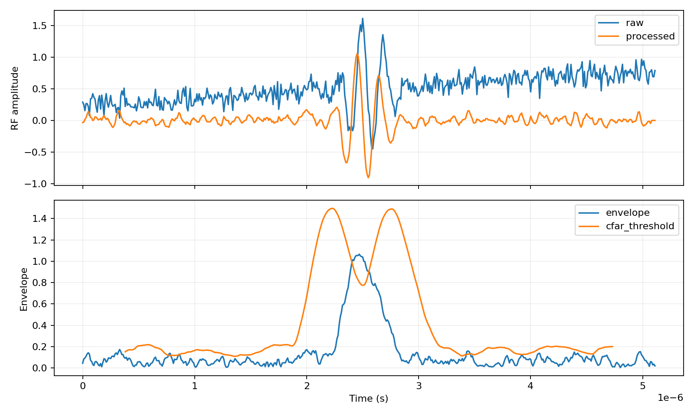
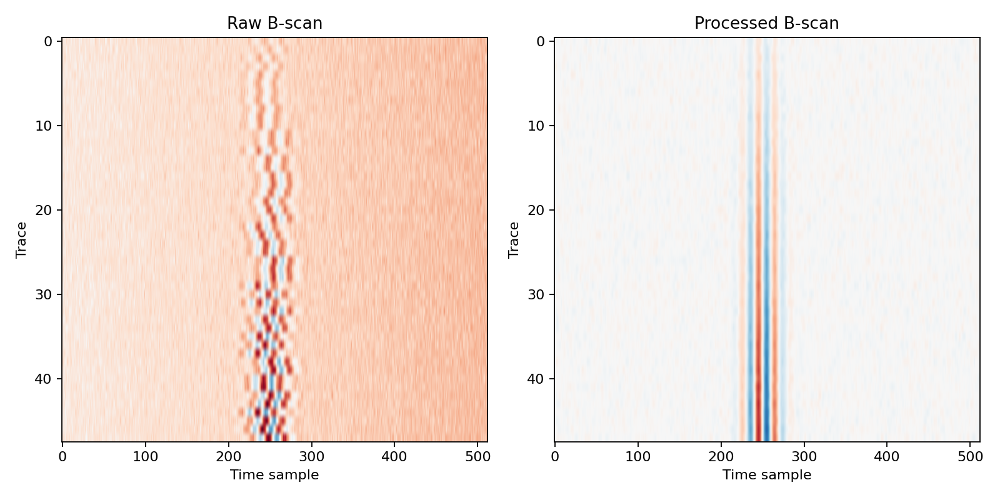
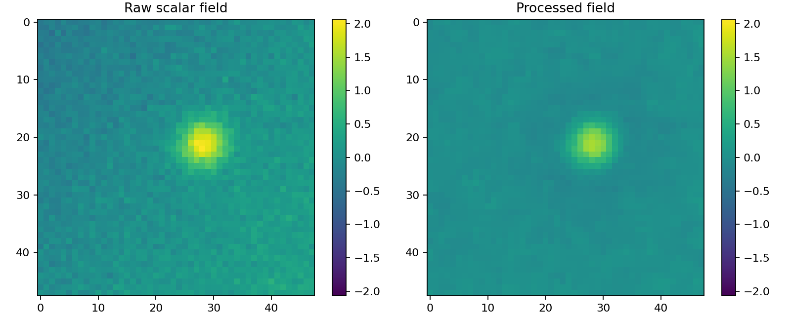
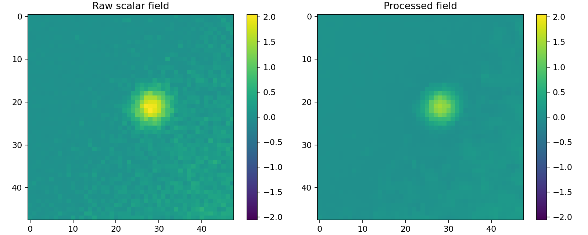
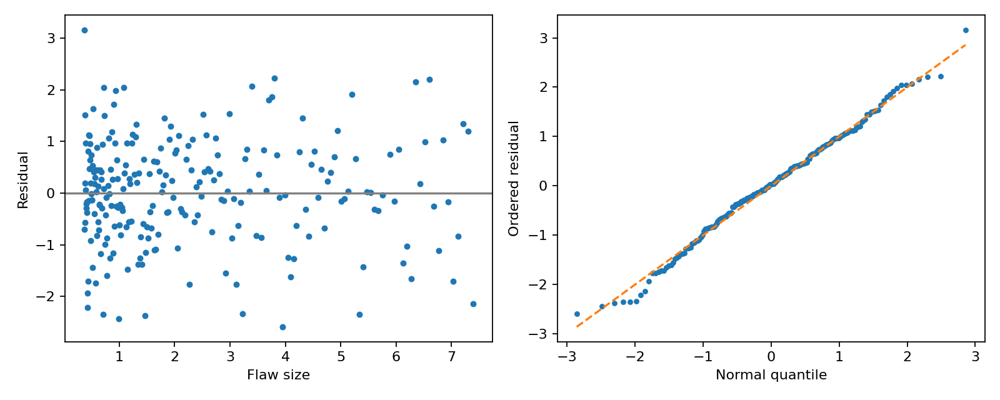

# 验证报告

日期：2026-10-08（用户客户端日期）；软件：OpenPOD 0.1。

## 1. 已执行和未执行的验证

已执行32项Python自动测试、GNU Octave 9.4.0 MATLAB接口自测、R 4.5.0 + survival 3.8.3与第三方7.3.7选定原函数对比。测试日志和原始CSV/JSON保存在validation目录。已运行的R参考包括原censored.regression、compute.a.POD.etc，以及实际51×51旋转轮廓生成和插值函数。

没有取得或运行mh1823 7.3.0安装包；没有运行MATLAB R2014b–R2020a；没有用真实UT盲测数据验证。本报告不能作为这些未完成项的通过证明。GitHub workflow是交付的检查配置，尚未在GitHub运行。

## 2. 标准示例对比

条件锁定：示例1为x=log(size)、y=identity，decision=200，左右删失界为−Inf/+Inf；示例2为4列平衡重复、decision=250、left=200、right=600、重复因子4；示例3使用length.inch、identity尺寸和四种链接，绘图范围min(size)至2×max(size)。这些设置是本次明确设置，不能冒称所有手册截图的默认参数。

| 用例 | R参考a90/95 | Python精确边界 | Python历史网格 | 精确/旧网格差异 |
|---|---:|---:|---:|---:|
| example1 | 13.37034235 | 13.37034212 | — | -1.750906e-06% |
| example2 | 15.31536378 | 15.31536449 | — | 4.632677e-06% |
| example3_logit | 0.1973404145 | 0.1973540502 | 0.1973404801 | 0.006909747% |
| example3_probit | 0.1972789478 | 0.1972880758 | 0.1972789489 | 0.004626954% |
| example3_cloglog | 0.194256309 | 0.1942754276 | 0.1942563001 | 0.009841947% |
| example3_loglog | 0.2095178645 | 0.2095543473 | 0.2095179037 | 0.01741271% |

â–a示例1/2的a90/95差异均小于0.00001%；四种hit/miss直接优化与旧轮廓插值的差异约0.0046%–0.0174%。历史网格的Python和R检出限最大绝对差异小于10⁻⁷；R输出原值未重新舍入覆盖。

有限样本R GLM的默认IRLS收敛容差与SciPy优化容差不同，特别是loglog、cloglog可有微小MLE差异。协方差对比按√(ViiVjj)归一化，避免接近零的交叉项导致相对误差失真。最大标准示例归一化协方差误差约2.03×10⁻⁴。原始表见comparison.csv。

## 3. Python与MATLAB接口（实际运行Octave）

| 指标 | 最大误差 |
|---|---:|
| signal_parameter_max_abs | 6.74356e-09 |
| signal_cov_max_abs | 9.9472e-11 |
| signal_limit_max_relative | 1.30001e-09 |
| binary_logit_max_abs | 1.59933e-07 |
| binary_probit_max_abs | 3.27203e-08 |
| binary_cloglog_max_abs | 2.09846e-08 |
| binary_loglog_max_abs | 8.86137e-08 |
| trace_processed_max_abs | 2.33147e-15 |
| trace_envelope_max_abs | 1.85268e-15 |
| trace_cfar_threshold_max_abs | 6.66134e-16 |
| legacy_bound_matlab_python_max_abs | 4.31603e-11 |
| legacy_bound_matlab_R_max_abs | 6.56019e-08 |

仅指定基线掩码的RF流程的逐点波形/包络一致性在此证明；可选带通、空间滤波边界、MC/MCMC随机序列不要求逐点一致。不同语言随机数生成器不是同一条随机序列。

## 4. CFAR与前处理

固定seed=1823，在18000个独立指数功率样本上，training=16/side、guard=4、目标PFA=0.01；可用单元17960。

| 方法 | alpha | 实测PFA | 误报数 |
|---|---:|---:|---:|
| CA | 4.9530235 | 0.0090757238 | 163 |
| OS | 3.8382768 | 0.0091870824 | 165 |

这是功率假设下的算法检查，不等于超声包络、C扫或整次检查的PFA证明。训练单元相关时，误报率的二项独立置信计算也不再直接有效。

合成48迹B扫的时移补偿平均绝对误差=0.0采样点。第20迹窗口功率比：处理前6.2496dB，处理后15.2142dB。此指标是信号门平均功率/基线门平均功率，未扣除信号门中的噪声。

## 5. MAPOD、层级与贝叶斯示例

高斯随机截距示例：总体a90=3.2306938，组内sigma=0.297619，组間tau=0.405466。GP独立验证点RMSE=0.00378192（合成响应单位）。

删失MCMC：split-Rhat=[1.0016731493583133, 1.0054739426069836, 1.0036761209419427]；ESS=[452.80538845326913, 464.9097793100198, 429.2097746180276]；接受率=[0.275, 0.22833333333333333, 0.23083333333333333, 0.26]。当前seed下Rhat<1.01、ESS>400，converged_diagnostic=True；这不验证先验合理性或模型是否正确。

示例MAPOD数据在mapod.csv；模拟器是声明的合成统计响应，传递函数在独立生成校准对上拟合。它不是COMSOL/CIVA求解结果。MC误差、校准参数误差和真实物理模型误差分别说明，不能合并成未经验证的一个95%置信保证。

## 6. 小规模覆盖率实验

固定seed=20261008，共100次独立模拟，每次n=120。删失signal拟合成功100次，尺寸Wald上限覆盖率0.95，Monte Carlo标准误0.0218；binary拟合成功100次，历史LR-df1上限覆盖率0.96，标准误0.0196。

100次仅为可重复示例，不能证明所有数据机制或极端参数的名义覆盖。signal上限目标为单侧0.95；历史binary LR95、df1约定在正则情形下对应约0.975的单侧分位上限，不应把二者的标签理解成同一数学定义。若用于正式研究，应扩展多种样本量、删失比例、相关程度和重复结构，并报告Monte Carlo误差。

## 7. 复核文件与后续验收

32个测试覆盖解析Gaussian MLE/协方差、四链接statsmodels、极端正负尾区间、混合删失参数恢复、MAR拒绝/接受、重复因子、数据拒绝、五种噪声、噪声删失、29/29下界、协变量、MAPOD/GP、层级与Bayes、四变换、分组GOF、历史网格、CA/OS实测PFA、零填充对齐、3D数据、SNR/dB/标定等。

下一步需要7.3.0实际安装包/基准导出、目标MATLAB老版本、真实匿名UT数据及明确的误差容差。`功能覆盖与验收.md`给出了具体可执行验收清单，不将这些缺项隐藏在“完全替代”字样中。